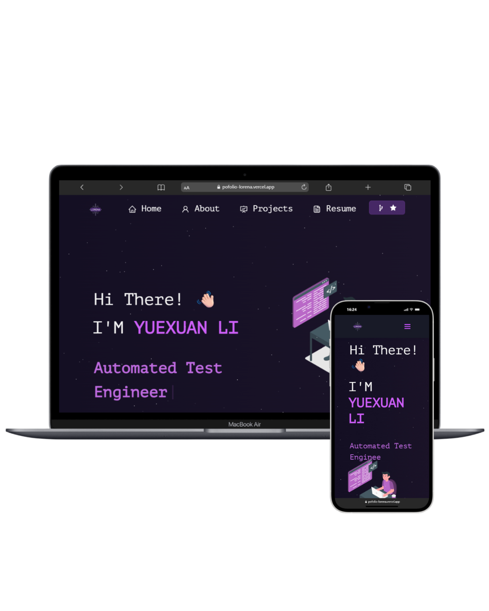

<h1 align="center">
  Yuexuan Li | 李悦轩
</h1>

<h3 align="center">
  Personal Portfolio Website
</h3>

<p align="center">
  Test Engineer | Computational Neuroscience Researcher | BCI & ML Enthusiast
</p>

<div align="center">
  
</div>

<br/>

<p align="center">
  <a href="https://github.com/LorenaYuethuen/Portfolio">
    
  </a>
  <a href="https://github.com/LorenaYuethuen/Portfolio">
    
  </a>
  <a href="https://github.com/LorenaYuethuen/Portfolio">
    
  </a>
</p>

<h3 align="center">
  <a href="#about">About</a> •
  <a href="#features">Features</a> •
  <a href="#tech-stack">Tech Stack</a> •
  <a href="#installation">Installation</a> •
  <a href="#contact">Contact</a>
</h3>

## 📖 About

Welcome to my personal portfolio! I'm **Yuexuan Li**, a Test Engineer with a strong background in Computational Neuroscience and Cognitive Robotics. This portfolio showcases my professional journey, research projects, and technical expertise.

### 🎓 Education
- **MSc in Computational Neuroscience and Cognitive Robotics** - University of Birmingham (2022-2023)
- **BSc in Computer Science and Technology** - Xi'an University of Architecture and Technology (2018-2022)

### 💼 Professional Focus
- **Software Testing & QA**: Full-chain automated testing, performance optimization, data-driven testing
- **Computational Neuroscience**: Brain attention mechanisms, cognitive modeling, EEG analysis
- **Brain-Computer Interfaces**: BCI systems, emotion regulation, physiological signal processing
- **Machine Learning**: Feature extraction, predictive modeling, data analysis

## ✨ Features

### Portfolio Sections
- **🏠 Home**: Dynamic typing animation showcasing my roles and expertise
- **👤 About**: Educational background, technical skills, and GitHub activity
- **💼 Projects**: Featured work experience and research projects with PDF previews
- **📄 Resume**: Downloadable CV with direct preview
- **📱 Contact**: Social media links and WeChat QR code modal

### Special Features
- **📄 PDF Preview**: Click to view research papers and project documentation
- **💬 WeChat QR Code Modal**: Interactive popup for WeChat contact
- **📧 Direct Email Links**: Quick access to email communication
- **🌙 Dark Theme**: Modern dark-themed UI design
- **📱 Fully Responsive**: Optimized for desktop, tablet, and mobile devices
- **⚡ Fast Loading**: Optimized performance and smooth animations

## 🛠 Tech Stack

### Frontend
- **React.js** (v17.0.2) - UI framework
- **React Bootstrap** - Responsive components
- **React Router** - Navigation
- **React Icons** - Icon library
- **Typewriter Effect** - Dynamic text animations

### Testing & Tools
- **Python** - Automation scripts
- **MATLAB** - Data analysis and modeling
- **JMeter** - Performance testing
- **Git** - Version control

### Deployment
- **Node.js** - Runtime environment
- **npm** - Package management
- Ready for **Vercel**, **Netlify**, or **GitHub Pages** deployment

## 🚀 Installation

### Prerequisites
- **Node.js** (v14 or higher)
- **npm** or **yarn**
- **Git**

### Setup Instructions

1. **Clone the repository**
```bash
git clone https://github.com/LorenaYuethuen/Portfolio.git
cd Portfolio
```

2. **Install dependencies**
```bash
npm install
```

3. **Start development server**
```bash
npm start
```

4. **Open in browser**
```
http://localhost:3000
```

### Build for Production

```bash
npm run build
```

The optimized production build will be in the `build/` folder.

## 📂 Project Structure

```
Portfolio/
├── public/              # Static files
├── src/
│   ├── Assets/         # Images, PDFs, icons
│   │   ├── Projects/   # Project images
│   │   └── TechIcons/  # Technology icons
│   ├── components/     # React components
│   │   ├── Home/       # Home page components
│   │   ├── About/      # About section
│   │   ├── Projects/   # Projects showcase
│   │   ├── Resume/     # Resume section
│   │   ├── Footer.js   # Footer component
│   │   ├── Navbar.js   # Navigation bar
│   │   └── WechatModal.js  # WeChat QR modal
│   ├── App.js          # Main app component
│   └── style.css       # Global styles
├── package.json
└── README.md
```

## 🎨 Customization

To customize this portfolio for your own use:

1. **Update Personal Info**: Edit `src/components/Home/Home.js` and `src/components/About/AboutCard.js`
2. **Add Projects**: Modify `src/components/Projects/Projects.js`
3. **Update Skills**: Edit `src/components/About/Techstack.js`
4. **Change Resume**: Replace PDF in `src/Assets/`
5. **Update Contact**: Modify social links in `src/components/Footer.js` and `src/components/Home/Home.js`

## 📧 Contact

- **Email**: [LorenaYxl@outlook.com](mailto:LorenaYxl@outlook.com)
- **LinkedIn**: [linkedin.com/in/yuexuan-li-ab84b1283](https://www.linkedin.com/in/yuexuan-li-ab84b1283)
- **GitHub**: [@LorenaYuethuen](https://github.com/LorenaYuethuen)
- **Instagram**: [@lorena_yuethuen](https://www.instagram.com/lorena_yuethuen/)
- **WeChat**: lyx319932362584

## 📝 License

This project is open source and available under the [MIT License](LICENSE).

## 🙏 Acknowledgments

- Original template inspired by open-source portfolio projects
- Icons from [React Icons](https://react-icons.github.io/react-icons/)
- UI components from [React Bootstrap](https://react-bootstrap.github.io/)

---

<p align="center">
  Made with ❤️ by Yuexuan Li
</p>

<p align="center">
  <a href="#top">⬆️ Back to Top</a>
</p>
